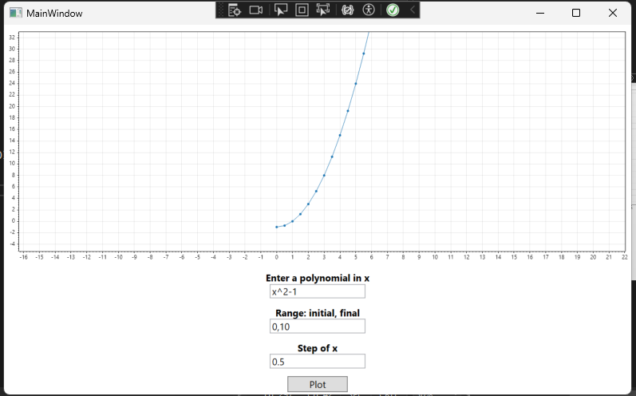

# WPF-plot-polynomial

This repository contains WPF project for plotting polynomials using Scottplot library. This is a basic setup that can be used to enhance your own project.

The main feature is the segregation of a polynomial into coefficients that then can be used to make an array for different values of x and be plotted using Scottplot.

While working on a project, I needed to plot a polynomial and I could not find relevant information in one place. I used regex to separate the coefficients of different patterns, no regex worked properly until I made my own and added to it.

### How it works:

- Run the project in your windows laptop.
- Type in a polynomial equation in "x" 
  - eg: x^2+1, X^2+2*x-1, x, x+1 etc.
- Type in range of x in the format: initial, final. 
  - 0,10 is the default.
- Type in step of increment in x
  - 0.5 is the default.
- Click plot to see your plot of the input polynomial on the graph.

### How the code is:
- The input is matched with a regex
- It is then broken into different parts, and each part is then matched against other smaller regex for pattern matching
- Coeffeicients and powers of each experssion is noted
- Then for each value of x, the whole coefficients and powers are calculated making arrays of numbers
- Finally, the array is given to Scottplot for plotting.

### Here is an screenshot

### You can plot as many polynomials as you want!